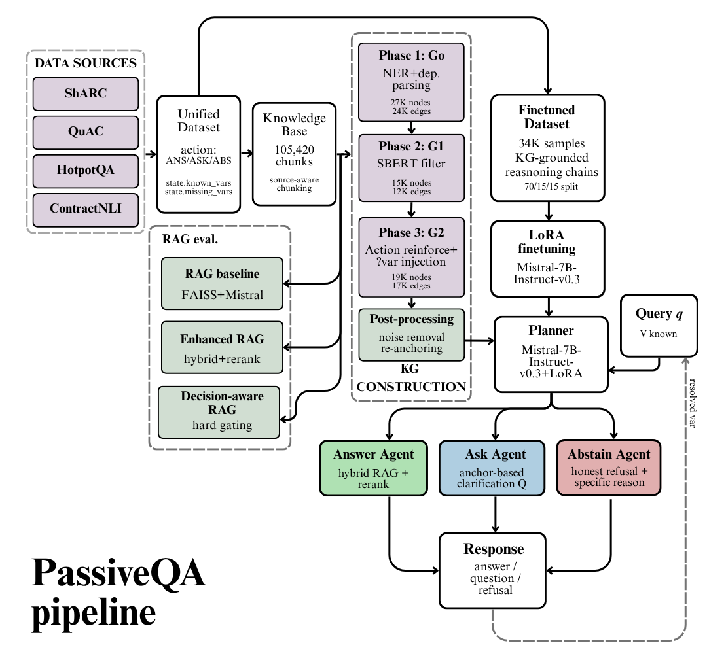
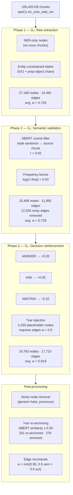
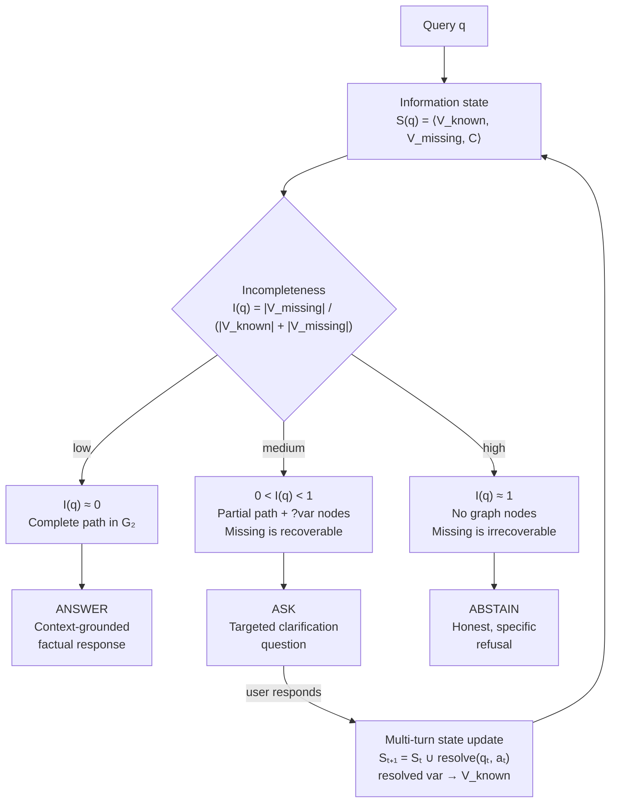

# PassiveQA: A Three-Action Framework for Epistemically Calibrated Question Answering via Supervised Finetuning

> **When should an LLM answer? When should it ask? When should it refuse?**  
> PassiveQA trains a language model to make that decision — instead of always generating an answer.

<p align="center">
  
</p>

[](https://arxiv.org/abs/2604.04565)
[](https://huggingface.co/Moodlerz/mistral-planner-aaqa)
[](LICENSE)
[](https://www.python.org/)


---

## What is PassiveQA?

Standard RAG systems and LLMs share one implicit assumption: **every query is answerable**. In practice, queries arrive incomplete, ambiguous, or about topics entirely absent from the knowledge base. The default LLM response to all three is the same — retrieve and generate — producing hallucinated, overconfident, or misleading answers.

PassiveQA replaces that default with a **three-action epistemic decision gate**:

| Action | Trigger | Mechanism |
|--------|---------|-----------|
| **ANSWER** | Graph contains a complete reasoning path | All required variables present |
| **ASK** | Graph is partial; gap is recoverable via dialogue | Targeted clarification question |
| **ABSTAIN** | Topic absent from KB; gap is irrecoverable | Honest, specific refusal |

This is implemented through:

1. A **decision-weighted knowledge graph** (G₂) whose edge weights encode three-action behavioural supervision
2. A **34K-sample finetuning dataset** of KG-grounded structured reasoning chains
3. A **LoRA-finetuned Mistral-7B planner** that explicitly models missing variables and produces structured decisions
4. A **three-agent execution architecture** routing to specialised Answer, Ask, and Abstain agents

**Key result:** The finetuned planner achieves **55.6% macro F1** — a +20.3 pp gain over the best inference-time RAG baseline — with Abstain recall rising from 13.3% to 58.1% and hallucination rate falling from 42.7% to 33.8%. This demonstrates empirically that epistemic calibration cannot be achieved at inference time and must be trained into the model.

---

## Why This Matters

- **Hallucination reduction**: the planner refuses to answer when evidence is insufficient, cutting hallucination at the source rather than detecting it post-hoc
- **Clarification seeking**: the Ask agent generates targeted, grounded clarification questions for multi-turn QA — not generic "please clarify" prompts
- **Honest abstention**: the Abstain agent distinguishes between "topic absent from KB" and "topic present but information irrecoverable", giving the user actionable feedback
- **Training-time alignment**: all three RAG baselines (including one with hybrid retrieval, cross-encoder reranking, query decomposition, and self-reflection) plateau at 34–38% decision accuracy; only finetuning breaks this ceiling

---

## Knowledge Graph Construction

The KG is the central novel artefact of PassiveQA. Unlike standard factual KGs, G₂ encodes **epistemic utility** — edge weights reflect not just semantic grounding but behavioural supervision from 273,809 training triples.



---

## Three-Action Decision Framework



---

## RAG Baseline vs. Finetuned Planner

| System | Accuracy | Macro F1 | Ask Recall | Abstain Recall | Hallucination Rate |
|--------|----------|----------|------------|----------------|--------------------|
| Baseline RAG | 34.0% | 26.7% | 2.0% | 26.0% | 42.7% |
| Enhanced RAG | 34.0% | 26.7% | 12.0% | 9.0% | 51.7% |
| Decision-aware RAG v3 | 38.0% | 35.3% | 40.0% | 13.3% | 33.8% |
| **PassiveQA (finetuned)** | **55.6%** | **55.6%** | **32.6%** | **58.1%** | **33.8%** |

> **Key finding:** All three RAG architectures — including one with hybrid retrieval, cross-encoder reranking, query decomposition, and self-reflection — plateau at 34–38% accuracy. Two epochs of LoRA finetuning on KG-grounded reasoning chains surpasses this ceiling by +20.3 pp macro F1.

---

## Paper and Model

**Paper:** *PassiveQA: A Three-Action Framework for Epistemically Calibrated Question Answering via Supervised Finetuning*  
**Author:** Madhav S Baidya, IIT (BHU) Varanasi  
**Model:** [`Moodlerz/mistral-planner-aaqa`](https://huggingface.co/Moodlerz/mistral-planner-aaqa)

---

## Repository Structure

```
PassiveQA/
├── src/
│   ├── data/
│   │   ├── dataset_builders.py       # Unified dataset from 4 QA benchmarks
│   │   └── variable_population.py    # known_variables / missing_variables via GPT-4o-mini
│   ├── rag/
│   │   ├── baseline_rag.py           # Baseline RAG (chunking + FAISS + Mistral)
│   │   ├── enhanced_rag.py           # Enhanced RAG (semantic chunking, BM25, rerank, reflect)
│   │   └── decision_aware_rag.py     # Decision-aware RAG v3 (hard gating — inference ceiling)
│   ├── kg/
│   │   └── knowledge_graph.py        # 3-phase KG construction G₀ → G₁ → G₂ + post-processing
│   ├── finetune/
│   │   ├── dataset_creation.py       # KG-grounded finetuning sample builder
│   │   ├── train.py                  # LoRA training via SFTTrainer
│   │   └── evaluate.py               # Per-class F1, confusion matrix, per-source breakdown
│   └── agents/
│       ├── agents.py                 # ANSWER / ASK / ABSTAIN response generators
│       └── pipeline.py               # Planner → routing → agent dispatch
│
├── notebooks/
│   ├── 01_dataset_eda.ipynb          # Dataset loading and EDA (4 sources)
│   ├── 02_dataset_construction.ipynb # Unified dataset construction + balancing
│   ├── 03_rag_experiments.ipynb      # Baseline + Enhanced + Decision-aware RAG
│   ├── 04_knowledge_graph.ipynb      # KG build, checkpointing, EDA
│   ├── 05_finetune_dataset.ipynb     # Finetuning dataset creation + interactive viewer
│   ├── 06_training.ipynb             # LoRA training run
│   └── 07_evaluation_agents.ipynb    # Evaluation + planner + three-agent pipeline
│
├── requirements.txt
└── README.md
```

---

## Quick Start

### 1. Install dependencies

```bash
pip install -r requirements.txt
python -m spacy download en_core_web_sm
```

### 2. Run the finetuned planner (inference only)

```python
from transformers import AutoTokenizer, AutoModelForCausalLM
from peft import PeftModel
import torch

MODEL_ID   = "mistralai/Mistral-7B-Instruct-v0.3"
ADAPTER_ID = "Moodlerz/mistral-planner-aaqa"

tokenizer  = AutoTokenizer.from_pretrained(ADAPTER_ID)
base_model = AutoModelForCausalLM.from_pretrained(
    MODEL_ID, torch_dtype=torch.bfloat16, device_map="auto"
)
model = PeftModel.from_pretrained(base_model, ADAPTER_ID)
model.eval()

from src.agents.pipeline import run_pipeline

result = run_pipeline(
    query             = "Am I eligible for the AcmeCorp pension plan?",
    known_variables   = ["AcmeCorp", "pension plan"],
    graph_triples     = [
        "pension plan | require | employment type",
        "pension plan | require | years of service",
        "pension plan | requires | ?unknown_1",
    ],
    missing_variables = ["employment type", "years of service"],
    model             = model,
    tokenizer         = tokenizer,
)

print(result["action"])    # → ASK
print(result["response"])  # → "Regarding pension plan: could you specify employment type?"
```

### 3. Full pipeline (from raw data)

Follow the notebooks in order:

```
01 → EDA on four source datasets
02 → Build the 61K unified dataset with action labels and variable states
03 → Reproduce the three RAG baselines (establishes the inference ceiling)
04 → Build G₀ → G₁ → G₂ with checkpointing
05 → Generate the 34K KG-grounded finetuning corpus
06 → LoRA finetune on L4/A100 GPU (~2 hours)
07 → Evaluate planner + run three-agent pipeline
```

---

## Datasets Used

| Dataset | Domain | QA Type | Key signal for PassiveQA |
|---------|--------|---------|--------------------------|
| [QuAC](https://quac.ai/) | Wikipedia | Multi-turn conversational | `CANNOTANSWER` → Abstain; `followup=y` → Ask |
| [ShARC](https://sharc-data.github.io/) | Government policy | Rule-based conditional | Evidence chain → explicit Ask supervision |
| [HotpotQA](https://hotpotqa.github.io/) | Wikipedia | Multi-hop reasoning | All Answer; bridge/comparison reasoning types |
| [ContractNLI](https://stanfordnlp.github.io/contract-nli/) | Legal contracts | NLI / entailment | `NotMentioned` → Abstain (39.2% of annotations) |

---

## Planner Output Format

The finetuned planner always produces structured XML output. Zero unparseable responses across 5,218 test samples.

```xml
<reasoning>
Step 1 | Query subject: pension plan, AcmeCorp
Step 2 | Graph search: matched nodes 'pension plan'.
         Relations: require (employment type), require (years of service),
         requires (?unknown_1). Path incomplete.
Step 3 | Variable check: Known: AcmeCorp, pension plan.
         Required but absent: employment type, years of service.
         Failure mode: INSUFFICIENT_VARIABLES.
Step 4 | Decision rationale: graph has partial connections but cannot
         complete the reasoning path without: employment type.
</reasoning>

<decision>
ASK
</decision>

<justification>
Regarding pension plan: could you specify employment type?
</justification>

<clarification_question>
Regarding pension plan: could you specify employment type?
</clarification_question>
```

---

## Unified Dataset Schema

Every training sample shares this JSON structure across all four sources:

```json
{
  "id": "sharc_000042",
  "query": "Am I eligible for the pension plan?",
  "context": {
    "documents": [{"doc_id": "...", "text": "...", "url": "..."}]
  },
  "state": {
    "known_variables": ["pension plan"],
    "missing_variables": ["employment type", "years of service"],
    "failure_mode": "INSUFFICIENT_VARIABLES",
    "difficulty": "medium",
    "completeness": "partial"
  },
  "action": "ASK",
  "response": "Could you provide your employment type?",
  "metadata": {
    "source": "sharc",
    "multi_turn": false,
    "turn_id": null,
    "dialogue_id": null,
    "requires_reasoning": true,
    "source_specific": {
      "sharc_answer": "Follow-on",
      "evidence_depth": 2,
      "history_depth": 0
    }
  }
}
```

---

## LoRA Configuration

| Hyperparameter | Value |
|----------------|-------|
| Base model | `mistralai/Mistral-7B-Instruct-v0.3` |
| LoRA rank (r) | 32 |
| LoRA alpha (α) | 64 |
| Target modules | `q_proj, k_proj, v_proj, o_proj, gate_proj, up_proj, down_proj` |
| Trainable parameters | ~83M (1.15% of 7.24B) |
| Sequence length | 512 tokens |
| Effective batch size | 32 (4 × 8 grad accum) |
| Learning rate | 2e-4 (cosine decay) |
| Training samples | 9,000 (26% of 34K available) |
| Epochs | 2 |

> Results are a **lower bound**. A full run over 34K samples with 1,024-token sequences is expected to yield ~67% macro F1, based on the single-turn vs. multi-turn accuracy gap (78.4% vs. 25.6%).

---

## Contributing

Contributions are very welcome. PassiveQA is an early-stage research codebase and there are several open directions where community help would be genuinely valuable.

### Ways to contribute

- **Full training run**: the current model is trained on 26% of the available data for 2 epochs under compute constraints. Running the full 34K dataset with 1,024-token sequences and reporting results would be a high-impact contribution.
- **KB expansion**: plug in a new domain corpus (medical, legal, financial) using the existing KG construction pipeline and report how the planner generalises out-of-distribution.
- **Ablation studies**: compare G₀ vs. G₁ vs. G₂ context in the finetuning dataset to quantify the contribution of each KG phase to planner accuracy.
- **Variable population alternatives**: the current pipeline uses GPT-4o-mini for `known_variables` / `missing_variables` population. Open-source alternatives (Llama-3, Qwen, etc.) would improve reproducibility.
- **Multi-turn evaluation**: a proper multi-turn test harness where the user actually responds to the Ask agent's clarification question and the pipeline continues.
- **Bug reports and documentation improvements**: the codebase reflects a research prototype; cleaner APIs, type hints, and docstrings are all useful.

### How to contribute

1. Fork the repository
2. Create a feature branch: `git checkout -b feature/your-contribution`
3. Make your changes with clear commit messages
4. Open a pull request describing what you changed and why
5. If you are running experiments, please include a short results table in the PR description

If you are unsure whether something is worth contributing or want to discuss an idea before implementing it, open an issue — all research directions, questions, and suggestions are welcome.

---

## Limitations

- **Sequence truncation**: the 512-token budget truncates multi-turn history, which is the primary cause of the single-turn/multi-turn accuracy gap (78.4% vs. 25.6%)
- **KG coverage**: 41.3% of finetuning samples have no KG triples — these rely on entity-presence/absence signal only, producing thinner reasoning chains
- **Variable population**: `missing_variables` were populated via GPT-4o-mini; extraction errors propagate into finetuning supervision labels
- **Compute constraints**: 2 epochs on 26% of the available finetuning data — results are a lower bound, not a ceiling

---

## Future Work

- [ ] Full training run: 34K samples, 1,024-token sequences, 3 epochs with hyperparameter search
- [ ] Contrastive ASK/ABSTAIN training pairs to sharpen the recoverability decision boundary
- [ ] KB expansion to domain-specific corpora (medical, financial, legal) where epistemic passivity has the highest stakes
- [ ] RLHF alignment of Ask/Abstain behaviour with explicit user preference signals
- [ ] Dynamic KG updates for live, continuously changing knowledge bases
- [ ] Multi-turn convergence analysis: how many Ask turns does it take to reach Answer?
- [ ] Node-type labelling in G₂ to prevent domain-mismatch hallucination (entity present, topic absent)

---

## Citation

If you use PassiveQA in your research, please cite:

```bibtex
@article{baidya2025passiveqa,
  title   = {PassiveQA: A Three-Action Framework for Epistemically Calibrated
             Question Answering via Supervised Finetuning},
  author  = {Baidya, Madhav S},
  year    = {2025},
  institution = {Indian Institute of Technology (BHU) Varanasi}
}
```
